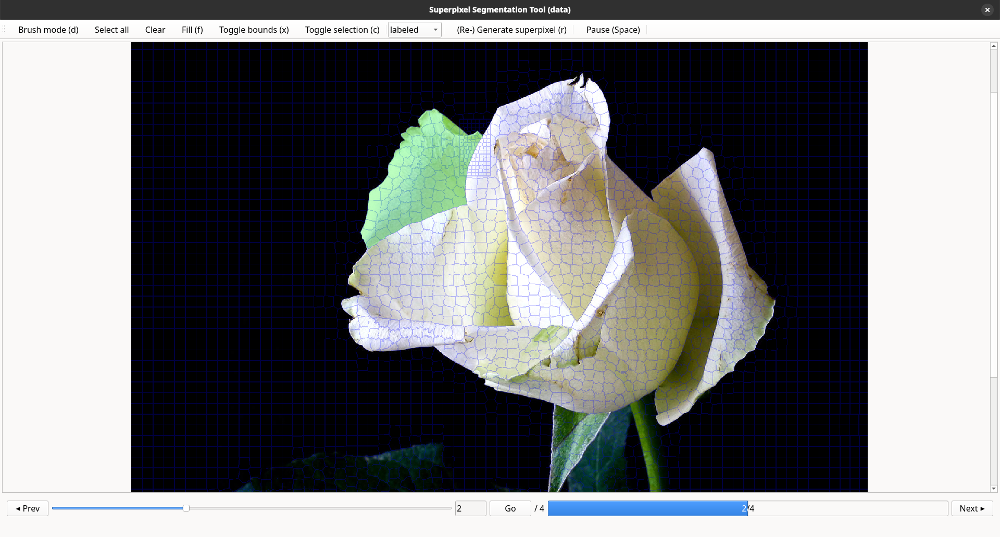

# Superpixel Labeling GUI

This project provides an interactive GUI tool to accelerate image annotation by leveraging superpixel segmentation. It uses SLIC-based superpixels to divide images into coherent regions, enabling users to label entire segments instead of individual pixels, significantly reducing annotation time and effort.



---

## Features

- PyQt6-based GUI for efficient, manual region labeling using superpixels.  
- Batch-compatible pre-segmentation pipeline using SLIC.  
- Optional overlay visualization to aid labeling accuracy.  
- Jupyter and CLI support for preprocessing.  
- Parallel processing support for faster segmentation.  
- Logs labeling status (`unlabeled`, `labeled`, `skip`, `review`) in `label_log.csv`.  
- Status updates automatically or via GUI selection.  
- All progress is saved on close, Ctrl+S, and after each frame change.

> **Note:** This tool is designed for binary segmentation labeling. Multi-class annotation is supported through multiple runs, each targeting a different class.

---

## Quick Start

If you just want to use the GUI without precomputed masks and without installing Python, grab a prebuilt binary from the [Releases page](https://github.com/marcadrianpeters/superpixel_labeling_tool/releases):

1. **Download**  
   - **Linux:** `superpixel_labeling_tool-linux`  
   - **Windows:** `superpixel_labeling_tool.exe`

2. **Make executable (Linux only)**  
   ```bash
   chmod +x superpixel_labeling_tool-linux
   ```

3. **Run**  
   - **Linux:**  
     ```bash
     ./superpixel_labeling_tool-linux
     ```  
   - **Windows:**  
     Double-click `superpixel_labeling_tool.exe`  
     > **Warning:** Windows may display an “Unknown Publisher” security warning. You can safely proceed by clicking **“Run anyway”**.

4. **Select Dataset Folder**  
   When the GUI opens, select your dataset’s root directory (e.g., `/path/to/dataset/`), which must include an `input/` subfolder containing your images.

---

## Installation & Setup (from Source)

### Prerequisites

- **Python 3.12** must be installed and accessible via `python` or `python3`.

> This project is tested with Python 3.12. Older versions may produce unpredictable results.

### Quick Setup Scripts

#### Linux/macOS

```bash
bash install_env.sh
```

#### Windows (PowerShell)

```powershell
.\setup.ps1
```

> **Execution Policy Note**: If PowerShell restricts script execution, allow it temporarily:
> ```powershell
> Set-ExecutionPolicy -Scope Process -ExecutionPolicy Bypass
> ```

### Activate the Virtual Environment

#### Linux/macOS

```bash
source .venv/bin/activate
```

#### Windows (PowerShell)

```powershell
.\.venv\Scripts\Activate.ps1
```

---

## Workflow Overview

The GUI launches via a file dialog. However, your dataset directory must follow the structure below and may include precomputed masks or generate them on the fly.

### Step 1: (Optional) Precompute Superpixel Masks

```bash
python run_superpixel_segmentation.py /path/to/dataset \
  --pixels_per_superpixel 150 \
  --num_workers 4
```

- `--pixels_per_superpixel`: Controls the superpixel size.  
- `--num_workers`: Number of parallel processes.

> If `superpixel_masks/` is missing, you can generate masks manually in the GUI using **R + drag**.

### Step 2: Launch the GUI

```bash
python gui.py
```

Expected directory structure:

```
/path/to/dataset/
├── input/                  # input images (required)
├── superpixel_masks/       # optional; can be generated via GUI or script
└── segmentation_masks/     # created by GUI; stores labeled masks
```

> **Note:**  
> - If `segmentation_masks/` is missing, it will be created automatically.  
> - If `superpixel_masks/` is absent, you must regenerate masks via **R + drag** before labeling.

---

## GUI Controls

- **Left-click:** Select/deselect superpixel.  
- **Right-click drag:** Brush select.  
- **D:** Change brush mode.  
- **F:** Fill enclosed holes.  
- **X:** Toggle superpixel boundary visibility.  
- **C:** Toggle segmentation mask visibility.  
- **R + Drag on image:** Regenerate superpixels in selected region.  
- ** <- / -> (Arrow keys):** Navigate images.  
- **Space:** Pause/unpause.

---

## Licensing Notice

This project uses open-source packages, including libraries under the [GPLv3 License](https://www.gnu.org/licenses/gpl-3.0.en.html). Redistribution of modified versions must comply with GPLv3 terms.